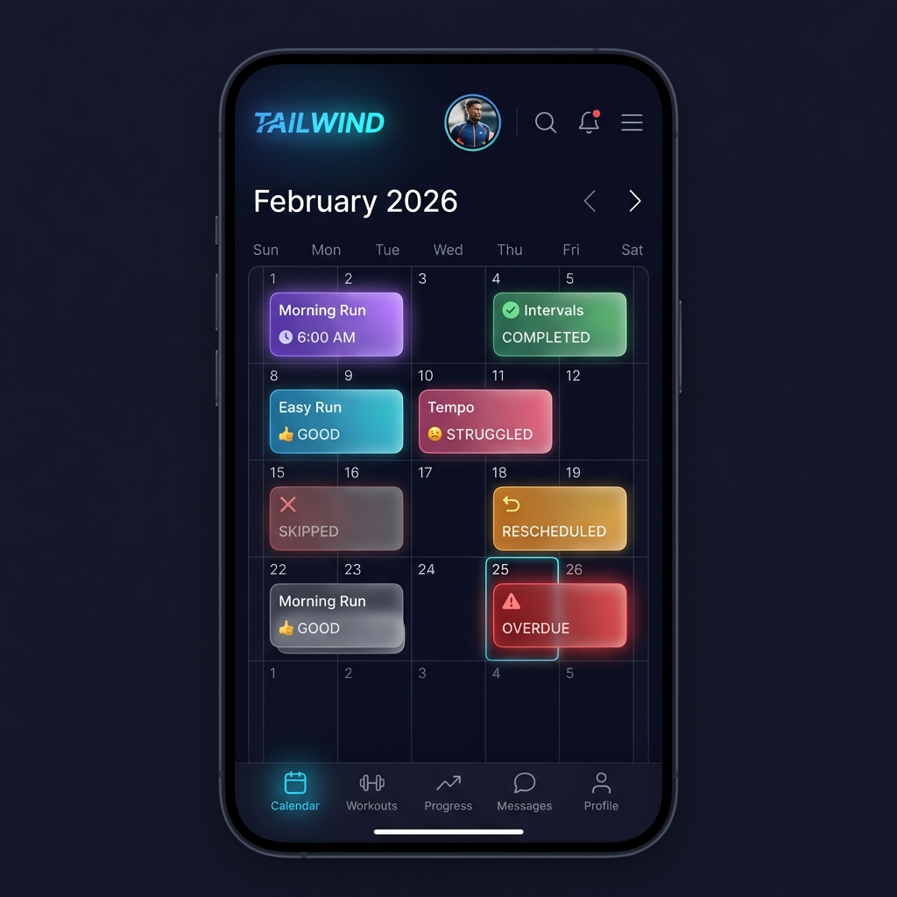
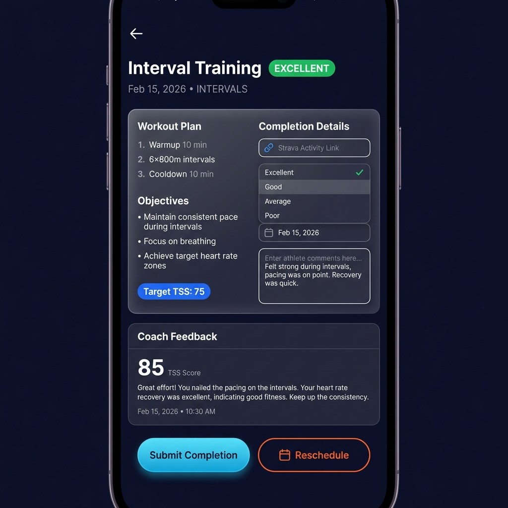
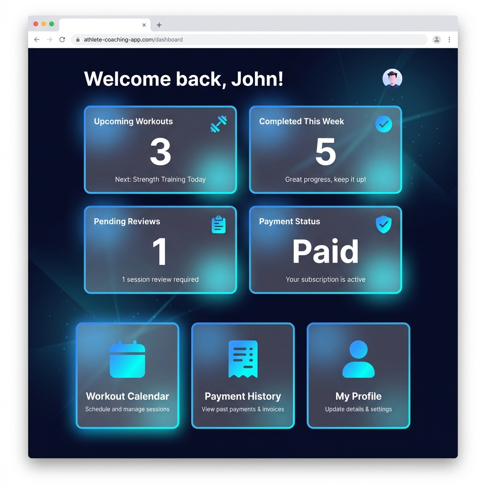
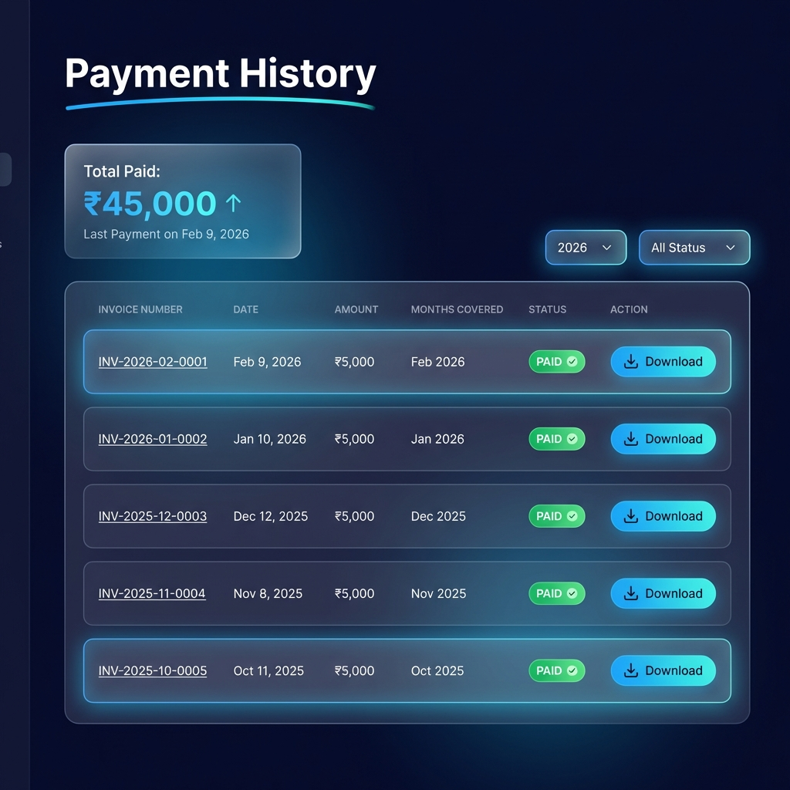
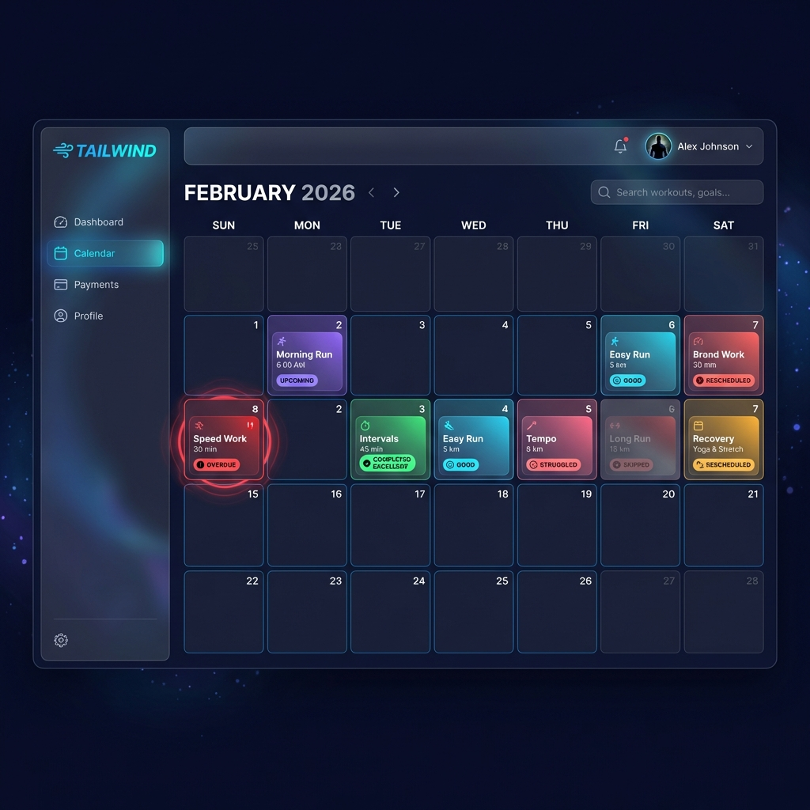
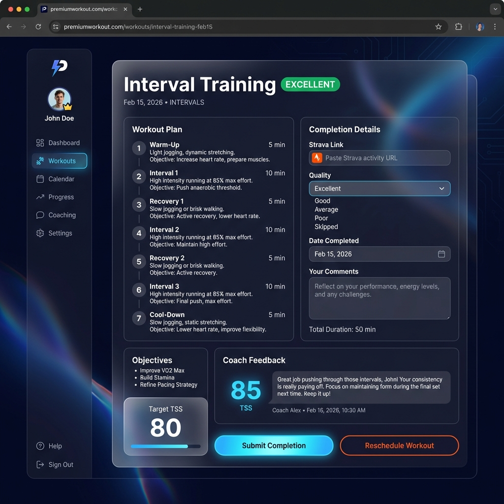
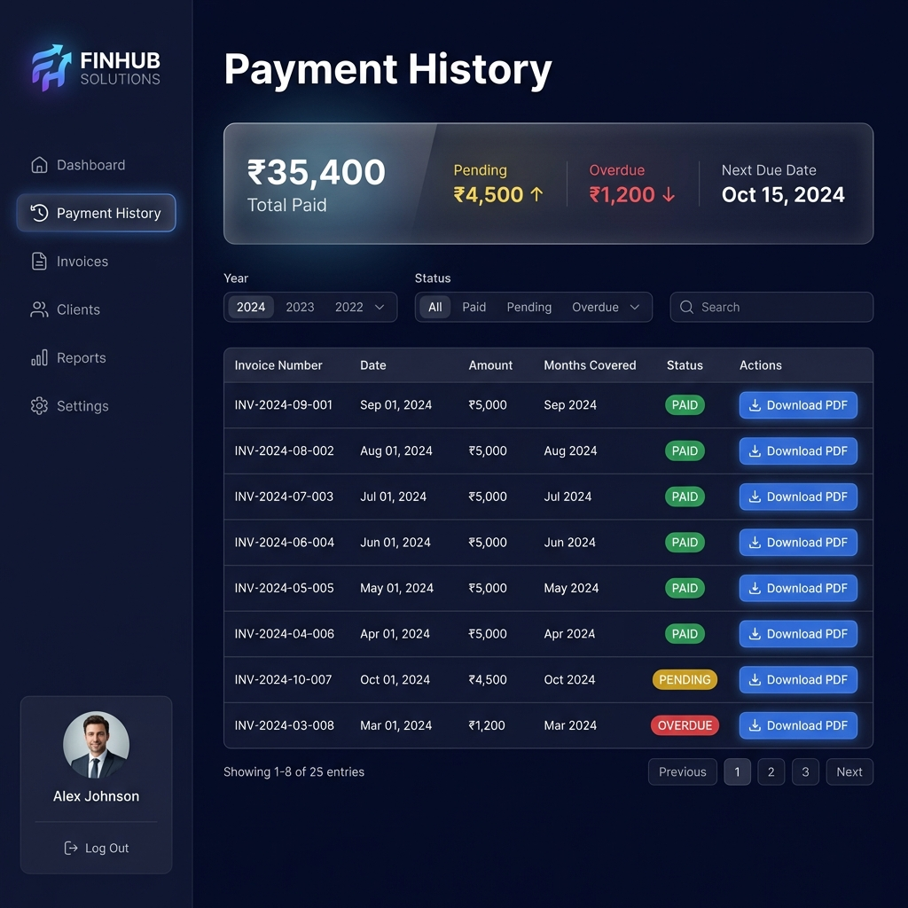
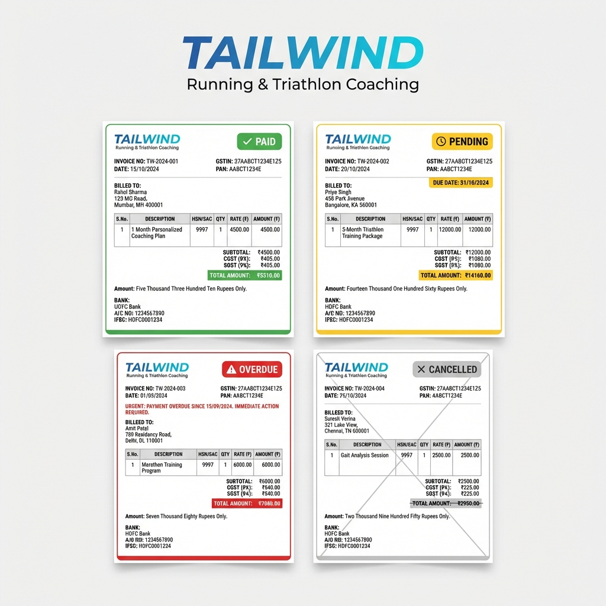
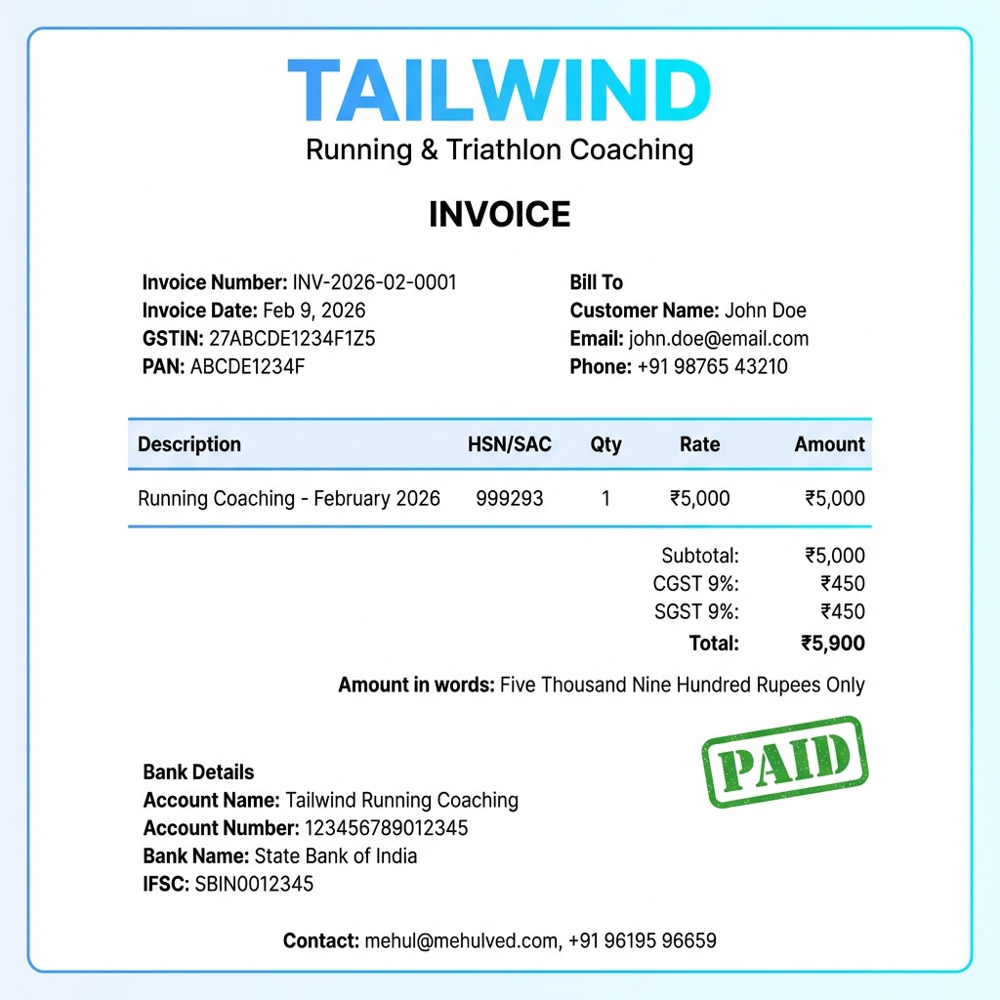

# Complete UI Mockups - Athlete Management Application

> [!NOTE]
> This is a **responsive web application** accessed via browser at `app.tailwindrun.com`. Not a native mobile app.

---

## Table of Contents

1. [Mobile Views](#mobile-views)
2. [Desktop Views](#desktop-views)
3. [Invoice PDFs](#invoice-pdfs)
4. [Responsive Design](#responsive-design)
5. [Color Specifications](#color-specifications)

---

## Mobile Views

### 1. Workout Calendar (Mobile)



**Features:**
- Dark navy background (#0f0f23)
- TAILWIND logo with blue-cyan gradient
- Monthly calendar view (February 2026)
- Card-based workout layout
- Bottom navigation bar (Calendar, Workouts, Progress, Messages, Profile)
- User avatar and notifications in top bar

**Workout Status Colors:**
- 🟣 **Purple gradient** - "Morning Run 6:00 AM" (UPCOMING)
- 🟢 **Green gradient** - "Intervals COMPLETED" (EXCELLENT quality)
- 🔵 **Blue-cyan gradient** - "Easy Run GOOD" (GOOD quality)
- 🔴 **Pink-red gradient** - "Tempo STRUGGLED" (STRUGGLED quality)
- ⚫ **Faded red** - "SKIPPED" (missed workout)
- 🟡 **Orange-yellow gradient** - "RESCHEDULED" (moved to new date)
- 🔴 **Red pulsing** - "OVERDUE" (past due, not completed)

**Interactions:**
- Tap workout card to view details
- Swipe left/right for previous/next month
- Pull to refresh

---

### 2. Workout Detail (Mobile)



**Features:**
- Back navigation arrow
- Workout title "Interval Training" with green "EXCELLENT" badge
- Date and type: "Feb 15, 2026 • INTERVALS"
- Single-column stacked layout

**Sections:**
1. **Workout Plan**
   - Numbered steps (Warmup, Intervals, Cooldown)
   - Objectives with bullet points
   - Target TSS badge (80)

2. **Completion Details**
   - Strava activity link input
   - Quality dropdown (Excellent, Good, Average, Poor)
   - Date completed picker
   - Athlete comments textarea
   - Total duration display

3. **Coach Feedback**
   - Large TSS score (85)
   - Coach comments
   - Review timestamp

**Actions:**
- Blue-cyan gradient "Submit Completion" button
- Orange outlined "Reschedule Workout" button

---

### 3. Athlete Dashboard (Mobile)



**Features:**
- Personalized welcome: "Welcome back, Kumar!"
- 4 stat cards with glassmorphism:
  - **Upcoming Workouts**: 3 this week
  - **Completed This Week**: 4 workouts
  - **Pending Reviews**: 1 workout
  - **Payment Status**: Current (green indicator)

**Navigation Cards:**
- 🗓️ **Workout Calendar** - View and track workouts
- 💳 **Payment History** - Invoices and payments
- 👤 **My Profile** - Personal information

**Bottom Navigation:**
- Calendar, Workouts, Progress, Messages, Profile

---

### 4. Payment History (Mobile)



**Features:**
- Total paid summary card: "₹35,400 Total Paid"
- Filter by year and status
- Card-based invoice list

**Each Invoice Card Shows:**
- Invoice number (INV-2024-09-001)
- Date (Sep 01, 2024)
- Amount (₹5,000)
- Month covered (Sep 2024)
- Status badge (PAID, PENDING, OVERDUE)
- Download PDF button

**Status Colors:**
- 🟢 Green "PAID"
- 🟡 Yellow "PENDING"
- 🔴 Red "OVERDUE"

---

## Desktop Views

### 5. Workout Calendar (Desktop)



**Features:**
- Left sidebar navigation (Dashboard, Calendar, Payments, Profile)
- TAILWIND logo in sidebar
- Full monthly grid layout (7 columns: Sun-Sat)
- Top bar with search, notifications, user profile
- Larger workout cards with more details

**Calendar Grid:**
- Each day cell ~150px wide
- Multiple workouts per day visible
- Hover effects on workout cards
- Click to open workout detail

**All 7 Workout States Visible:**
1. Purple - Morning Run (UPCOMING)
2. Green - Intervals (COMPLETED - Excellent)
3. Blue-cyan - Easy Run (COMPLETED - Good)
4. Pink-red - Tempo (COMPLETED - Struggled)
5. Faded red - Long Run (SKIPPED)
6. Orange-yellow - Recovery (RESCHEDULED)
7. Red pulsing - Speed Work (OVERDUE)

---

### 6. Workout Detail (Desktop)



**Features:**
- Left sidebar navigation
- Browser chrome visible (web app)
- Large glassmorphism card
- Two-column layout

**Layout:**
- **Left Column (wider)**: Workout Plan
  - Detailed steps with durations and objectives
  - Target TSS badge (80)
  - Objectives list
  
- **Right Column**: Completion Details
  - Strava link input with icon
  - Quality dropdown (expanded showing all options)
  - Date picker
  - Comments textarea
  - Duration display

**Bottom Section (full-width):**
- Coach Feedback
- Large TSS score (85)
- Coach comments
- Timestamp

**Actions:**
- Blue-cyan "Submit Completion" button
- Orange "Reschedule Workout" button

---

### 7. Payment History (Desktop)



**Features:**
- Left sidebar navigation
- Summary cards at top:
  - ₹35,400 Total Paid
  - ₹4,500 Pending (yellow, up arrow)
  - ₹1,200 Overdue (red, down arrow)
  - Next Due Date: Oct 15, 2024

**Data Table:**
- Columns: Invoice Number, Date, Amount, Months Covered, Status, Actions
- Filter controls: Year dropdown (2024, 2023, 2022), Status filter (All, Paid, Pending, Overdue)
- Search bar
- Pagination (Showing 1-8 of 25 entries)

**Status Badges:**
- Green "PAID" pills
- Yellow "PENDING" pills
- Red "OVERDUE" pills

**Actions:**
- Blue "Download PDF" button for each invoice

---

## Invoice PDFs

### 8. Invoice States Comparison



**Four Invoice Templates Side-by-Side:**

#### A) PAID Invoice (Top Left)
- ✅ Green "PAID" badge with checkmark
- Green left border (5px solid #11998e)
- Payment confirmation message
- Payment received date and method shown
- Standard professional layout

#### B) PENDING Invoice (Top Right)
- ⏰ Yellow "PENDING" badge with clock icon
- Yellow left border (5px solid #ffa751)
- Due date highlighted in yellow box: "DUE DATE: 11/10/2024"
- "Payment Due" message
- Bank details section emphasized

#### C) OVERDUE Invoice (Bottom Left)
- ⚠️ Red "OVERDUE" badge with warning icon
- Red left border (5px solid #ff6b6b)
- Urgent red text: "URGENT: PAYMENT OVERDUE SINCE 10/28/2024. IMMEDIATE ACTION REQUIRED"
- Days overdue prominently displayed
- Late payment consequences notice

#### D) CANCELLED Invoice (Bottom Right)
- ✖️ Gray "CANCELLED" badge with X
- Gray left border (5px solid #999)
- Strikethrough on total amount
- "This invoice is void" notice
- Reduced opacity (0.7)
- Cancellation date shown

**Common Elements in All Invoices:**
- TAILWIND branding with blue-cyan gradient logo
- "Running & Triathlon Coaching" subtitle
- Invoice number (INV-TW-2024-XXX)
- Date and GSTIN/PAN numbers
- Customer billing details (name, email, phone)
- Line items table with HSN/SAC codes
- CGST/SGST breakdown (9% each) - **only if GSTIN present**
- Total amount in rupees
- Amount in words
- Payment details (Bank account OR UPI ID)
- Contact information footer

---

### 9. Sample Invoice PDF (Detailed)



**Invoice Details:**
- **Invoice Number**: INV-2026-02-0001
- **Date**: 6th February 2026
- **PAN**: AHVPV5259J (no GSTIN - no GST charged)
- **Customer**: Kumar Abhijeet
- **Email**: kumarabhijeet1202@gmail.com
- **Phone**: 8210330554

**Line Item:**
- Description: Running Coaching - February 2026
- HSN/SAC: RUNFOCUS1MO
- Quantity: 1
- Rate: ₹5,000
- Amount: ₹5,000

**Totals:**
- Subtotal: ₹5,000
- **No GST** (since no GSTIN)
- **Total: ₹5,000**
- Amount in words: "Five Thousand Rupees Only"

**Payment Details:**
- UPI ID: mved@ybl (prominently displayed)

**Footer:**
- Thank you message
- Contact: mehul@mehulved.com, +91 96195 96659

---

## Responsive Design

### Breakpoints

```css
/* Mobile First (default) */
.container {
  max-width: 100%;
  padding: 16px;
}

/* Tablet (768px+) */
@media (min-width: 768px) {
  .container {
    max-width: 720px;
    padding: 24px;
  }
  
  .calendar-grid {
    display: grid;
    grid-template-columns: repeat(7, 1fr);
  }
}

/* Desktop (1024px+) */
@media (min-width: 1024px) {
  .container {
    max-width: 960px;
  }
  
  .sidebar {
    display: block;
    width: 240px;
  }
  
  .workout-detail {
    grid-template-columns: 2fr 1fr;
  }
}

/* Large Desktop (1280px+) */
@media (min-width: 1280px) {
  .container {
    max-width: 1200px;
  }
}
```

### Layout Differences

| Feature | Mobile | Desktop |
|---------|--------|---------|
| **Navigation** | Bottom tab bar | Left sidebar |
| **Layout** | Single column, stacked | Multi-column, sidebar |
| **Calendar** | Card-based, scrollable | Full grid, 7 columns |
| **Forms** | Full-screen modals | Inline panels |
| **Tables** | Card list view | Full data table |
| **Actions** | Sticky bottom buttons | Inline buttons |
| **Gestures** | Swipe, tap, long-press | Click, hover, keyboard |

---

## Color Specifications

### Workout Status Colors

```css
/* Upcoming workouts */
.workout-upcoming {
  background: linear-gradient(135deg, #667eea 0%, #764ba2 100%);
  border-left: 4px solid #667eea;
}

/* Completed - Excellent */
.workout-excellent {
  background: linear-gradient(135deg, #11998e 0%, #38ef7d 100%);
  border-left: 4px solid #11998e;
}

/* Completed - Good/Satisfactory */
.workout-good {
  background: linear-gradient(135deg, #4facfe 0%, #00f2fe 100%);
  border-left: 4px solid #4facfe;
}

/* Completed - Struggled */
.workout-struggled {
  background: linear-gradient(135deg, #f093fb 0%, #f5576c 100%);
  border-left: 4px solid #f093fb;
}

/* Skipped */
.workout-skipped {
  background: rgba(255, 255, 255, 0.05);
  border-left: 4px solid #ff6b6b;
  opacity: 0.6;
}

/* Rescheduled */
.workout-rescheduled {
  background: linear-gradient(135deg, #ffa751 0%, #ffe259 100%);
  border-left: 4px solid #ffa751;
}

/* Overdue (past date, not completed) */
.workout-overdue {
  background: rgba(255, 107, 107, 0.2);
  border-left: 4px solid #ff6b6b;
  animation: pulse 2s infinite;
}

@keyframes pulse {
  0%, 100% { opacity: 1; }
  50% { opacity: 0.7; }
}
```

### Invoice Status Colors

```css
.invoice-paid {
  border-left: 5px solid #11998e;
}

.invoice-pending {
  border-left: 5px solid #ffa751;
  background: rgba(255, 167, 81, 0.05);
}

.invoice-overdue {
  border-left: 5px solid #ff6b6b;
  background: rgba(255, 107, 107, 0.1);
}

.invoice-cancelled {
  border-left: 5px solid #999;
  opacity: 0.7;
}
```

### Brand Colors

```css
:root {
  /* Primary Brand */
  --brand-gradient-start: #4facfe;
  --brand-gradient-end: #00f2fe;
  
  /* Background */
  --bg-dark: #0f0f23;
  --bg-card: rgba(255, 255, 255, 0.05);
  
  /* Text */
  --text-primary: #ffffff;
  --text-secondary: #a0a0a0;
  
  /* Status Colors */
  --status-success: #11998e;
  --status-warning: #ffa751;
  --status-error: #ff6b6b;
  --status-info: #4facfe;
}
```

### Typography

```css
body {
  font-family: 'Inter', -apple-system, BlinkMacSystemFont, 'Segoe UI', sans-serif;
  font-size: 16px;
  line-height: 1.6;
  color: var(--text-primary);
}

h1 { font-size: 32px; font-weight: 700; }
h2 { font-size: 24px; font-weight: 700; }
h3 { font-size: 20px; font-weight: 600; }
h4 { font-size: 18px; font-weight: 600; }

.body-large { font-size: 18px; }
.body-regular { font-size: 16px; }
.body-small { font-size: 14px; }
.caption { font-size: 12px; }
```

### Glassmorphism Effect

```css
.glass-card {
  background: rgba(255, 255, 255, 0.05);
  backdrop-filter: blur(10px);
  border-radius: 16px;
  border: 1px solid rgba(255, 255, 255, 0.1);
  box-shadow: 0 8px 32px rgba(0, 0, 0, 0.3);
}
```

---

## Screen Inventory

### Athlete-Facing Screens

1. ✅ **Athlete Dashboard** (Mobile + Desktop)
2. ✅ **Workout Calendar** (Mobile + Desktop)
3. ✅ **Workout Detail** (Mobile + Desktop)
4. ✅ **Payment History** (Mobile + Desktop)
5. ✅ **Profile View** (Specified in implementation plan)

### PDF Documents

6. ✅ **Invoice PDF - Paid**
7. ✅ **Invoice PDF - Pending**
8. ✅ **Invoice PDF - Overdue**
9. ✅ **Invoice PDF - Cancelled**

### Coach-Facing Screens

10. Django Admin (default Django admin interface)
    - Athlete management
    - Payment tracking
    - Workout creation
    - Invoice generation

---

## Access Information

**URL**: `app.tailwindrun.com`

**Supported Browsers**:
- Chrome 90+
- Safari 14+
- Firefox 88+
- Edge 90+

**Devices**:
- Mobile phones (iOS, Android)
- Tablets (iPad, Android tablets)
- Desktop computers (Mac, Windows, Linux)

**No app download required** - Access via web browser only.
