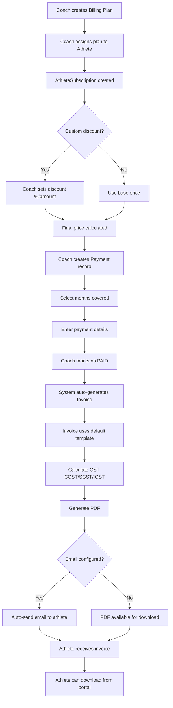

# Athlete Management App - Implementation Plan

A Django-based web application for managing coaching athletes, tracking payments, and maintaining workout journals.

## User Review Required

> [!IMPORTANT]
> **Project Location**: The app will be created in a new directory `athlete_management` within `/Users/Admin/Projects/tailwind-coaching/`
> 
> **Deployment**: app.tailwindrun.com
> 
> **Technology Stack**:
> - Django 5.x (latest stable)
> - SQLite database (can be changed to PostgreSQL later)
> - Django Admin for initial interface (fast to build, powerful)
> 
> **Design & Styling**:
> - Color theme will match the landing page exactly:
>   - Primary gradient: `linear-gradient(135deg, #667eea 0%, #764ba2 100%)`
>   - Speed gradient: `linear-gradient(90deg, #4facfe 0%, #00f2fe 100%)`
>   - Accent gradient: `linear-gradient(135deg, #f093fb 0%, #f5576c 100%)`
>   - Dark background: `#0f0f23`
>   - Card background: `rgba(255, 255, 255, 0.05)` with backdrop blur
>   - Text colors: `#e0e0e0` (light), `#ffffff` (bright)
> - Custom Django admin theme to match the landing page aesthetic
> - Responsive design with glassmorphism effects
> 
> **Key Design Decisions**:
> - **Two-tier authentication**: Coach (Django admin) and Athlete (custom interface)
> - Coach creates athlete accounts with initial passwords (athletes can change later)
> - Using Django Admin as the primary interface for coaches (fast to build, powerful)
> - Athletes get a custom interface to view workouts and add completions
> - Payment tracking uses a flexible month selection approach with JSON field
> - Workout journal uses a calendar-based view with clickable workout entries
> - Separation between workflow: coach creates workouts → athlete completes → coach reviews

## Deployment Options (Free Tier)

> [!NOTE]
> **Recommended: Railway.app** - Best balance of features and ease of use for Django apps

### Option 1: Railway.app (Recommended) ⭐
- **Free Tier**: $5 credit/month (enough for small apps)
- **Pros**:
  - One-click Django deployment
  - PostgreSQL database included
  - Custom domain support (app.tailwindrun.com)
  - Automatic HTTPS
  - GitHub integration for auto-deploy
  - File storage for PDFs
- **Setup**: Connect GitHub repo, Railway auto-detects Django
- **Database**: Upgrade SQLite to PostgreSQL (free tier)

### Option 2: Render.com
- **Free Tier**: Yes (with limitations)
- **Pros**:
  - Free PostgreSQL database
  - Custom domain support
  - Auto-deploy from GitHub
  - HTTPS included
- **Cons**:
  - Spins down after inactivity (slow first load)
  - Limited to 750 hours/month
- **File Storage**: Need external service (AWS S3 free tier) for PDFs

### Option 3: PythonAnywhere
- **Free Tier**: Yes
- **Pros**:
  - Django-friendly
  - Always-on (no spin down)
  - File storage included
- **Cons**:
  - No custom domain on free tier (use subdomain)
  - Manual deployment process
  - Limited to SQLite on free tier

### Option 4: Fly.io
- **Free Tier**: Limited free resources
- **Pros**:
  - Good performance
  - PostgreSQL included
  - Custom domains
- **Cons**:
  - More complex setup
  - Credit card required (not charged on free tier)

### Recommended Configuration for Railway

```python
# settings.py additions for production
import dj_database_url

DATABASES = {
    'default': dj_database_url.config(
        default='sqlite:///db.sqlite3',
        conn_max_age=600
    )
}

# Static files
STATIC_ROOT = os.path.join(BASE_DIR, 'staticfiles')

# Media files (for invoice PDFs)
MEDIA_ROOT = os.path.join(BASE_DIR, 'media')
MEDIA_URL = '/media/'

# Security settings
if not DEBUG:
    SECURE_SSL_REDIRECT = True
    SESSION_COOKIE_SECURE = True
    CSRF_COOKIE_SECURE = True
```

**Domain Setup**:
1. Deploy to Railway
2. Get Railway URL (e.g., `your-app.up.railway.app`)
3. Add custom domain `app.tailwindrun.com` in Railway settings
4. Update DNS CNAME record: `app` → Railway URL

**Email for Free**:
- Gmail SMTP (free, 500 emails/day)
- SendGrid (free tier: 100 emails/day)
- Mailgun (free tier: 1000 emails/month)

## Proposed Changes

### Project Structure

```
athlete_management/
├── manage.py
├── athlete_management/          # Project settings
│   ├── __init__.py
│   ├── settings.py
│   ├── urls.py
│   └── wsgi.py
└── coaching/                    # Main app
    ├── __init__.py
    ├── models.py               # Data models
    ├── admin.py                # Admin interface customization
    ├── views.py                # Custom views (coach & athlete)
    ├── urls.py                 # URL routing
    ├── forms.py                # Custom forms
    ├── templates/              # HTML templates
    │   ├── base.html           # Base template with theme
    │   ├── registration/
    │   │   ├── login.html      # Athlete login
    │   │   └── password_change.html
    │   └── coaching/
    │       ├── athlete_dashboard.html
    │       ├── workout_calendar.html
    │       ├── workout_detail.html
    │       ├── payment_history.html
    │       └── invoice_pdf.html    # PDF template
    ├── static/
    │   └── css/
    │       └── theme.css       # Matching landing page theme
    └── migrations/
```

---

### Database Models

#### [NEW] [models.py](file:///Users/Admin/Projects/tailwind-coaching/athlete_management/coaching/models.py)

**User Model Extension**
- Extend Django's built-in User model for authentication
- `is_coach`: BooleanField (to distinguish coaches from athletes)
- Coaches use Django admin, athletes use custom interface

**Athlete Model**
- `user`: OneToOneField to User (for authentication)
- `athlete_id`: Auto-generated primary key
- `name`: CharField (required)
- `email`: EmailField (unique, synced with User.email)
- `contact_number`: CharField
- `address`: TextField (billing address for invoices)
- `profile`: TextField (bio, background, etc.)
- `goals`: TextField (athlete's goals)
- `fitness_evaluation`: TextField (initial fitness assessment)
- `created_at`, `updated_at`: Timestamps

**BillingPlan Model**
- `name`: CharField (e.g., "Running Focus - Monthly", "Triathlon Personal - Quarterly")
- `plan_type`: Choice field (RUNNING, TRIATHLON)
- `service_level`: Choice field (FOCUS, PERSONAL)
- `billing_period`: Choice field (MONTHLY, QUARTERLY)
- `hsn_sac`: CharField (HSN/SAC code for invoicing, auto-populated based on plan configuration)
  - **Available HSN/SAC codes**:
    - `RUNFOCUS1MO` - Running Focus Monthly
    - `RUNFOCUS1QTR` - Running Focus Quarterly
    - `TRIFOCUS1MO` - Triathlon Focus Monthly
    - `TRIFOCUS1QTR` - Triathlon Focus Quarterly
    - `RUNPERSONAL1MO` - Running Personal Monthly
    - `RUNPERSONAL1QTR` - Running Personal Quarterly
    - `TRIPERSONAL1MO` - Triathlon Personal Monthly
    - `TRIPERSONAL1QTR` - Triathlon Personal Quarterly
- `base_price`: DecimalField (standard price for this plan)
- `description`: TextField (plan details and features)
- `is_active`: BooleanField (whether plan is available for new subscriptions)
- `created_at`, `updated_at`: Timestamps

**HSN/SAC Auto-Generation**:
```python
def save(self, *args, **kwargs):
    # Auto-generate HSN/SAC code based on plan configuration
    prefix = "RUN" if self.plan_type == "RUNNING" else "TRI"
    level = "FOCUS" if self.service_level == "FOCUS" else "PERSONAL"
    period = "1MO" if self.billing_period == "MONTHLY" else "1QTR"
    self.hsn_sac = f"{prefix}{level}{period}"
    super().save(*args, **kwargs)
```

**AthleteSubscription Model**
- `athlete`: ForeignKey to Athlete
- `billing_plan`: ForeignKey to BillingPlan
- `custom_discount_percent`: DecimalField (0-100, default 0)
- `custom_discount_amount`: DecimalField (flat discount, default 0)
- `final_price`: DecimalField (calculated: base_price - discounts)
- `start_date`: DateField
- `end_date`: DateField (nullable for ongoing)
- `is_active`: BooleanField
- `notes`: TextField (reason for discount, etc.)
- `created_at`, `updated_at`: Timestamps

**Payment Model**
- `athlete`: ForeignKey to Athlete
- `subscription`: ForeignKey to AthleteSubscription (nullable)
- `billing_plan`: ForeignKey to BillingPlan (nullable, for reference)
- `amount`: DecimalField (actual amount paid)
- `payment_date`: DateField
- `payment_method`: Choice field (BANK_TRANSFER, UPI, CASH, CARD, OTHER)
- `transaction_reference`: CharField (optional, for tracking)
- `months_covered`: JSONField (list of month-year strings like ["2026-02", "2026-03"])
- `notes`: TextField (optional)
- `status`: Choice field (PENDING, PAID, FAILED, REFUNDED)
- `created_at`, `updated_at`: Timestamps

**InvoiceTemplate Model** (Indian Format)
- `name`: CharField (e.g., "Standard Indian Invoice")
- `is_default`: BooleanField
- `company_name`: CharField ("Tailwind Coaching")
- `company_address`: TextField
- `company_gstin`: CharField (GST number, optional)
- `company_pan`: CharField (PAN number, optional)
- `company_email`: EmailField
- `company_phone`: CharField
- `company_website`: URLField
- `bank_name`: CharField (for payment instructions)
- `bank_account_number`: CharField
- `bank_ifsc`: CharField
- `bank_account_holder`: CharField
- `bank_upi_id`: CharField (optional, for UPI payments like mved@ybl)
- `terms_and_conditions`: TextField
- `footer_note`: TextField (e.g., "Thank you for your business!")
- `include_gst`: BooleanField (whether to show GST fields)
- `gst_rate`: DecimalField (default 18.0 for services in India)
- `created_at`, `updated_at`: Timestamps

> [!IMPORTANT]
> **GST Calculation Logic**: GST should ONLY be charged if `company_gstin` is provided and valid. If no GSTIN, invoice shows base amount only without GST breakdown.

**Invoice Model**
- `payment`: OneToOneField to Payment (auto-created when payment marked as PAID)
- `template`: ForeignKey to InvoiceTemplate
- `invoice_number`: CharField (auto-generated, format: INV-YYYY-MM-XXXX)
- `invoice_date`: DateField (same as payment_date)
- `due_date`: DateField (optional)
- **Billing Details** (from template):
  - `company_name`, `company_address`, `company_gstin`, `company_pan`
  - `company_email`, `company_phone`, `company_website`
- **Customer Details** (from athlete):
  - `customer_name`, `customer_email`, `customer_phone`, `customer_address`
- **Line Items**: JSONField (auto-generated from subscription/plan)
  - Format: [{"description": "Running Coaching - Feb 2026", "hsn_sac": "999293", "quantity": 1, "rate": 5000, "amount": 5000}]
- **Amounts**:
  - `subtotal`: DecimalField (before tax)
  - `discount_percent`: DecimalField (from subscription)
  - `discount_amount`: DecimalField (calculated)
  - `taxable_amount`: DecimalField (subtotal - discount)
  - **GST fields (only populated if company_gstin is present)**:
    - `cgst_rate`: DecimalField (9% for intra-state, 0 if no GSTIN)
    - `cgst_amount`: DecimalField (0 if no GSTIN)
    - `sgst_rate`: DecimalField (9% for intra-state, 0 if no GSTIN)
    - `sgst_amount`: DecimalField (0 if no GSTIN)
    - `igst_rate`: DecimalField (18% for inter-state, 0 if no GSTIN)
    - `igst_amount`: DecimalField (0 if no GSTIN)
  - `total_amount`: DecimalField (taxable_amount + GST if applicable)
- `amount_in_words`: CharField (e.g., "Five Thousand Rupees Only")
- `payment_terms`: TextField (from template)
- `status`: Choice field (DRAFT, SENT, PAID, CANCELLED)
- `pdf_file`: FileField (stored PDF)
- `pdf_generated_at`: DateTimeField (nullable)
- `emailed_at`: DateTimeField (nullable)
- `created_at`, `updated_at`: Timestamps

**Invoice Generation Logic**:
```python
def calculate_invoice_amounts(subtotal, discount_percent, company_gstin, gst_rate=18.0):
    discount_amount = subtotal * (discount_percent / 100)
    taxable_amount = subtotal - discount_amount
    
    # Only charge GST if company has valid GSTIN
    if company_gstin and len(company_gstin) == 15:
        # Determine intra-state vs inter-state based on GSTIN state codes
        # For simplicity, assume intra-state (CGST + SGST)
        cgst_rate = gst_rate / 2  # 9%
        sgst_rate = gst_rate / 2  # 9%
        cgst_amount = taxable_amount * (cgst_rate / 100)
        sgst_amount = taxable_amount * (sgst_rate / 100)
        igst_amount = 0
        total_amount = taxable_amount + cgst_amount + sgst_amount
    else:
        # No GSTIN = No GST charged
        cgst_rate = sgst_rate = igst_rate = 0
        cgst_amount = sgst_amount = igst_amount = 0
        total_amount = taxable_amount
    
    return {
        'subtotal': subtotal,
        'discount_amount': discount_amount,
        'taxable_amount': taxable_amount,
        'cgst_rate': cgst_rate,
        'cgst_amount': cgst_amount,
        'sgst_rate': sgst_rate,
        'sgst_amount': sgst_amount,
        'igst_amount': igst_amount,
        'total_amount': total_amount
    }
```

**EmailSettings Model** (Singleton)
- `provider`: Choice field (GMAIL, SMTP, SENDGRID, MAILGUN, SES, OTHER)
- `smtp_host`: CharField (e.g., "smtp.gmail.com")
- `smtp_port`: IntegerField (default 587)
- `smtp_username`: CharField (email address)
- `smtp_password`: CharField (encrypted, or use environment variables)
- `use_tls`: BooleanField (default True)
- `use_ssl`: BooleanField (default False)
- `from_email`: EmailField (sender email)
- `from_name`: CharField ("Tailwind Coaching")
- `is_configured`: BooleanField (whether email is set up)
- `send_invoice_on_payment`: BooleanField (auto-send when marked paid)
- `email_subject_template`: CharField ("Invoice {invoice_number} from Tailwind Coaching")
- `email_body_template`: TextField (HTML email template)
- `last_tested_at`: DateTimeField (nullable)
- `test_successful`: BooleanField (nullable)
- `created_at`, `updated_at`: Timestamps

**Workout Model**
- `athlete`: ForeignKey to Athlete
- `date`: DateField (when workout is scheduled)
- `title`: CharField (e.g., "Morning Run", "Interval Training")
- `workout_type`: Choice field (EASY, TEMPO, INTERVALS, LONG_RUN, RECOVERY, RACE)
- `steps`: TextField (detailed workout steps)
- `objectives`: TextField (what the workout aims to achieve)
- `target_tss`: IntegerField (optional, target Training Stress Score)
- `status`: Choice field (UPCOMING, COMPLETED, SKIPPED, RESCHEDULED)
- `original_date`: DateField (nullable, if workout was rescheduled)
- `created_at`, `updated_at`: Timestamps

**WorkoutCompletion Model**
- `workout`: OneToOneField to Workout
- `athlete_link`: URLField (link to Strava, Garmin, etc.)
- `athlete_comments`: TextField
- `completion_quality`: Choice field (EXCELLENT, GOOD, SATISFACTORY, STRUGGLED, INCOMPLETE)
- `actual_date`: DateField (date actually completed, if different from scheduled)
- `tss`: IntegerField (Training Stress Score, nullable)
- `coach_comments`: TextField
- `completed_at`: DateTimeField (when athlete marked complete)
- `reviewed_at`: DateTimeField (when coach reviewed, nullable)

---

### Admin Interface Customization

#### [MODIFY] [admin.py](file:///Users/Admin/Projects/tailwind-coaching/athlete_management/coaching/admin.py)

**AthleteAdmin**
- List display: name, email, contact_number, active_subscription, created_at, has_user_account
- Search fields: name, email
- Filters: created_at, has active subscription
- Fieldsets for organized profile editing
- **Password Management**: Custom action to create/reset athlete login credentials
  - "Create User Account" button for athletes without login
  - "Reset Password" button to generate temporary password
  - Display temporary password to coach (for sharing with athlete)
- **Subscription Management**:
  - Inline display of active subscription with plan and pricing
  - "Create Subscription" button to assign billing plan
  - Shows custom discounts if applied
- Inline display of payments and recent workouts

**BillingPlanAdmin**
- List display: name, plan_type, billing_period, base_price, is_active
- List filter: plan_type, billing_period, is_active
- Search fields: name, description
- Actions: Activate/Deactivate plans
- Inline preview of athletes on this plan

**AthleteSubscriptionAdmin**
- List display: athlete, billing_plan, final_price, discount_display, start_date, is_active
- List filter: billing_plan, is_active, start_date
- Search fields: athlete__name, athlete__email
- **Custom Discount Interface**:
  - Percentage discount slider (0-100%)
  - Flat amount discount field
  - Auto-calculate final price display
  - Notes field for discount justification
- Actions: Activate/Deactivate subscriptions
- "Create Payment" button (pre-fills from subscription)

**PaymentAdmin** (Enhanced)
- List display: athlete, amount, payment_date, payment_method, status, has_invoice
- List filter: status, payment_method, payment_date
- Search fields: athlete__name, transaction_reference
- **Billing Info Page**: Custom view showing:
  - Athlete subscription details
  - Calculated amount from plan
  - Applied discounts
  - Month selection checkboxes
  - Payment method dropdown
  - Transaction reference field
- **Mark as Paid Action**:
  - Changes status to PAID
  - Auto-generates invoice from default template
  - Shows invoice preview
  - If email configured: offers to send invoice
  - Downloads PDF automatically
- Inline display on Athlete admin page

**InvoiceTemplateAdmin**
- List display: name, is_default, include_gst, gst_rate
- Actions: Set as Default
- **Template Editor**:
  - Company details form (name, address, GSTIN, PAN)
  - Bank details for payment instructions
  - Terms and conditions rich text editor
  - GST settings toggle
  - Preview button (generates sample invoice)
- Only one template can be default at a time

**InvoiceAdmin**
- List display: invoice_number, athlete_name, invoice_date, total_amount, status, emailed
- List filter: status, invoice_date, emailed_at
- Search fields: invoice_number, customer_name
- Read-only fields: all calculated amounts (subtotal, tax amounts, total)
- **Invoice Detail View**:
  - Shows complete invoice with Indian format
  - Line items display
  - GST breakdown (CGST/SGST or IGST)
  - Amount in words
- Actions:
  - "Download PDF" - generates and downloads invoice
  - "Email to Athlete" - sends invoice via configured email
  - "Mark as Sent" - updates status
  - "Regenerate PDF" - recreates PDF if template changed

**EmailSettingsAdmin** (Singleton)
- Single instance configuration page
- **Provider Selection**: Dropdown with popular providers
  - Gmail (pre-fills SMTP settings)
  - Custom SMTP
  - SendGrid, Mailgun, AWS SES (API-based)
- **SMTP Configuration**:
  - Host, port, username, password fields
  - TLS/SSL toggles
  - From email and name
- **Email Templates**:
  - Subject template with variables: {invoice_number}, {athlete_name}, {amount}
  - HTML body editor with invoice email template
- **Auto-send Settings**:
  - Toggle: "Send invoice automatically when payment marked as paid"
- **Test Email Button**:
  - Sends test email to coach
  - Updates last_tested_at and test_successful fields
  - Shows success/error message

**WorkoutAdmin**
- List display: athlete, date, title, has_completion
- List filter: athlete, date
- Date hierarchy: date
- Inline WorkoutCompletion

**WorkoutCompletionAdmin**
- List display: workout, completed_at, has_tss, reviewed_at
- Read-only fields for athlete_link and athlete_comments (coach shouldn't edit)
- Editable fields: tss, coach_comments

---

### Automated Invoice Workflow



**Key Automation Points:**
1. Invoice number auto-generated (INV-YYYY-MM-XXXX format)
2. Line items auto-populated from subscription/plan
3. Discounts automatically applied
4. GST calculated based on template settings
5. Amount converted to words (Indian format)
6. **PDF always generated and stored** (regardless of email config)
7. Email sent if configured (with PDF attachment)
8. **PDF always available for athlete download from portal**

---

### Custom Views & Templates

#### [NEW] [views.py](file:///Users/Admin/Projects/tailwind-coaching/athlete_management/coaching/views.py)

**Authentication Views**
- Athlete login view (custom styled to match theme)
- Password change view (athletes can update their password)
- Logout view

**Athlete Dashboard** (requires athlete login)
- Welcome message with athlete name
- Quick stats: upcoming workouts, completed this week, pending reviews
- **Payment summary**: Current month status, outstanding balance
- Link to workout calendar
- Link to payment history & invoices
- Link to profile view

**Payment History View** (requires athlete login)
- List all payments for the logged-in athlete
- Display: invoice number, date, amount, months covered, status
- Download invoice PDF button for each payment
- Filter by year/status
- Total paid summary

**Invoice PDF Generation**
- Professional invoice layout with Tailwind branding
- Invoice details: number, date, athlete info
- Line items table with descriptions and amounts
- Subtotal, tax (if applicable), total
- Payment status and date
- Coach/business contact information
- Styled to match landing page theme (colors, fonts)
- Uses ReportLab or WeasyPrint for PDF generation

**Workout Calendar View** (requires athlete login)
- Display workouts in a monthly calendar format
- Filtered automatically to logged-in athlete
- Click on date to see workouts for that day
- **Color coding by status and quality:**
  - Purple gradient: UPCOMING workouts
  - Green gradient: COMPLETED with EXCELLENT quality
  - Blue-cyan gradient: COMPLETED with GOOD/SATISFACTORY quality
  - Pink-red gradient: COMPLETED with STRUGGLED quality
  - Faded red: SKIPPED workouts
  - Orange-yellow gradient: RESCHEDULED workouts
  - Red pulsing: OVERDUE workouts (past date, not completed)
- Navigation: previous/next month
- Responsive design: Mobile (calendar cards), Desktop (full calendar grid)

**Workout Detail View** (requires athlete login)
- Show full workout details (steps, objectives, target TSS)
- Display completion status with color-coded badge
- **Athlete section**: 
  - Form to add workout link (Strava, Garmin, etc.)
  - Athlete comments textarea
  - Completion quality selector (EXCELLENT, GOOD, SATISFACTORY, STRUGGLED, INCOMPLETE)
  - Actual completion date picker (if different from scheduled)
  - Submit button to mark workout as complete
- **Coach section**: Display TSS and coach comments (read-only for athlete)
- **Reschedule option**: Button to reschedule workout to new date with reason

**Athlete Profile View** (requires athlete login)
- Display athlete information (name, email, contact, address)
- Show current subscription and billing plan
- Display goals and fitness evaluation (read-only)
- Link to change password
- Payment summary

---

### Django Project Configuration

#### [NEW] [settings.py](file:///Users/Admin/Projects/tailwind-coaching/athlete_management/athlete_management/settings.py)

- Configure SQLite database
- Add 'coaching' to INSTALLED_APPS
- Configure timezone to Asia/Kolkata
- Set up static files and media files
- Configure admin site customization

#### [NEW] [management/commands/create_default_invoice_template.py](file:///Users/Admin/Projects/tailwind-coaching/athlete_management/coaching/management/commands/create_default_invoice_template.py)

- Creates default InvoiceTemplate with Tailwind Coaching details
- Pre-fills company info, bank details, GST settings
- Sets as default template
- Idempotent (can run multiple times safely)

#### [NEW] [urls.py](file:///Users/Admin/Projects/tailwind-coaching/athlete_management/athlete_management/urls.py)

- Admin site URLs (for coaches)
- Authentication URLs (login, logout, password change)
- Athlete interface URLs:
  - `/` - Athlete dashboard (home)
  - `/calendar/` - Workout calendar
  - `/workout/<id>/` - Workout detail
  - `/workout/<id>/reschedule/` - Reschedule workout
  - `/payments/` - Payment history
  - `/invoice/<id>/pdf/` - Download invoice PDF
  - `/profile/` - Athlete profile view

---

### Templates

#### [NEW] [base.html](file:///Users/Admin/Projects/tailwind-coaching/athlete_management/coaching/templates/base.html)

**Base template for all athlete-facing pages**
- HTML5 structure with responsive meta tags
- **Header**:
  - TAILWIND logo with blue-cyan gradient
  - Navigation menu (if logged in): Dashboard, Calendar, Payments, Profile
  - User greeting and logout link
- **Theme CSS**:
  - Import Google Fonts (Inter)
  - Dark background (#0f0f23)
  - Glassmorphism card styles
  - Blue-cyan gradient utilities
  - Responsive grid system
- **Content blocks**:
  - `` - Page title
  - `` - Main content
  - `` - Page-specific styles
  - `` - Page-specific scripts
- **Footer**:
  - Copyright notice
  - Contact information
  - Links to terms and privacy

#### [NEW] [invoice_templates/](file:///Users/Admin/Projects/tailwind-coaching/athlete_management/coaching/templates/invoice_templates/)

**Multiple invoice templates for different states**:

1. **paid_invoice.html** - Standard paid invoice
   - Green "PAID" badge with checkmark icon
   - Green left border accent (5px solid #11998e)
   - Payment confirmation message
   - Payment received date and method
   - Standard layout with all GST details

2. **unpaid_invoice.html** - Pending payment
   - Yellow "PENDING" badge with clock icon
   - Yellow left border accent (5px solid #ffa751)
   - Due date prominently highlighted in yellow box
   - "Payment Due" message with days remaining
   - Bank details section highlighted
   - Payment instructions emphasized

3. **overdue_invoice.html** - Overdue payment
   - Red "OVERDUE" badge with warning icon
   - Red left border accent (5px solid #ff6b6b)
   - Urgent payment message in red text
   - Days overdue count displayed prominently
   - "Immediate Action Required" banner
   - Late payment consequences notice
   - Contact information for payment assistance

4. **cancelled_invoice.html** - Cancelled invoice
   - Gray "CANCELLED" badge with X icon
   - Gray left border accent (5px solid #999)
   - Strikethrough on total amount
   - Cancellation date and reason
   - Reference to replacement invoice (if applicable)
   - "This invoice is void" notice
   - Reduced opacity (0.7) for entire invoice

**Common elements**:
- Tailwind branding with gradient
- Indian GST format (GSTIN, PAN, HSN/SAC)
- Line items table
- GST breakdown (CGST/SGST or IGST)
- Amount in words
- Bank details
- Terms and conditions
- Status-specific styling and messaging

---

### Data Validation Rules

**Athlete Model**
- `email`: Valid email format, unique across athletes
- `contact_number`: Indian phone format (+91 followed by 10 digits)
- `address`: Required for invoice generation

**BillingPlan Model**
- `base_price`: Must be positive, max 2 decimal places
- `name`: Unique per plan_type and billing_period combination

**AthleteSubscription Model**
- `custom_discount_percent`: Range 0-100
- `custom_discount_amount`: Cannot exceed base_price
- `start_date`: Cannot be in the past (when creating)
- `end_date`: Must be after start_date (if provided)

**Payment Model**
- `amount`: Must be positive
- `payment_date`: Cannot be in the future
- `months_covered`: Valid month-year format (YYYY-MM)
- `transaction_reference`: Unique if provided

**InvoiceTemplate Model**
- `company_gstin`: Valid GSTIN format (15 characters, alphanumeric)
- `company_pan`: Valid PAN format (10 characters, AAAAA9999A)
- `bank_ifsc`: Valid IFSC format (11 characters)
- `gst_rate`: Range 0-28 (Indian GST slabs: 0, 5, 12, 18, 28)
- Only one template can have `is_default=True`

**Invoice Model**
- `invoice_number`: Auto-generated, unique, format INV-YYYY-MM-XXXX
- All amount fields: Non-negative, 2 decimal places
- `customer_email`: Valid email format
- `customer_phone`: Valid phone format

**Workout Model**
- `date`: Can be past or future
- `target_tss`: Positive integer if provided
- `original_date`: Must be different from current date if status is RESCHEDULED

**WorkoutCompletion Model**
- `athlete_link`: Valid URL format
- `actual_date`: Cannot be in the future
- `tss`: Positive integer

---

### Error Handling Strategy

**PDF Generation Failures**
- Catch ReportLab/WeasyPrint exceptions
- Log error with invoice details
- Show user-friendly error message
- Retry mechanism (up to 3 attempts)
- Fallback: Mark invoice as "PDF generation failed" for manual retry
- Admin notification for persistent failures

**Email Sending Failures**
- Catch SMTP exceptions
- Log error with email details
- Update invoice `emailed_at` only on success
- Show error message to coach
- Provide "Retry Send" button
- Queue failed emails for retry (background task)
- Don't block invoice creation if email fails

**Payment Processing Errors**
- Validate all fields before saving
- Atomic transactions for payment + invoice creation
- Rollback if invoice generation fails
- Clear error messages for validation failures
- Prevent duplicate payments (check transaction_reference)

**Database Errors**
- Graceful handling of connection failures
- Retry logic for transient errors
- User-friendly error pages
- Log all database errors
- Maintain data integrity with transactions

**File Upload Errors**
- Validate file size (max 10MB for PDFs)
- Check file type (PDF only)
- Handle storage full scenarios
- Virus scanning for uploaded files (future)

**Authentication Errors**
- Clear messages for invalid credentials
- Account lockout after 5 failed attempts
- Password reset flow
- Session timeout handling

---

### Backup & Restore Plan

**Database Backups**
- **Frequency**: Daily automated backups
- **Retention**: 30 days of daily backups, 12 months of monthly backups
- **Method**: 
  - Railway/Render: Use platform's backup feature
  - Manual: `python manage.py dumpdata > backup_YYYY-MM-DD.json`
- **Storage**: Off-site (AWS S3 free tier or Google Drive)
- **Testing**: Monthly restore test to verify backup integrity

**Media Files Backup** (Invoice PDFs)
- **Frequency**: Daily sync to cloud storage
- **Method**: rsync or rclone to AWS S3/Google Drive
- **Structure**: Maintain directory structure
- **Retention**: Permanent (invoices are legal documents)

**Restore Procedure**
1. Deploy fresh Django instance
2. Restore database from backup
3. Run migrations if needed
4. Restore media files
5. Verify data integrity
6. Test critical workflows

**Disaster Recovery**
- **RTO** (Recovery Time Objective): 4 hours
- **RPO** (Recovery Point Objective): 24 hours (daily backups)
- Document restoration steps
- Keep backup of environment variables
- Maintain list of dependencies

---

### Workout Color Scheme

**Calendar View Color Coding**

```css
/* Upcoming workouts */
.workout-upcoming { 
  background: linear-gradient(135deg, #667eea 0%, #764ba2 100%);
  border-left: 4px solid #667eea;
}

/* Completed - Excellent */
.workout-excellent {
  background: linear-gradient(135deg, #11998e 0%, #38ef7d 100%);
  border-left: 4px solid #11998e;
}

/* Completed - Good/Satisfactory */
.workout-good {
  background: linear-gradient(135deg, #4facfe 0%, #00f2fe 100%);
  border-left: 4px solid #4facfe;
}

/* Completed - Struggled */
.workout-struggled {
  background: linear-gradient(135deg, #f093fb 0%, #f5576c 100%);
  border-left: 4px solid #f093fb;
}

/* Skipped */
.workout-skipped {
  background: rgba(255, 255, 255, 0.05);
  border-left: 4px solid #ff6b6b;
  opacity: 0.6;
}

/* Rescheduled */
.workout-rescheduled {
  background: linear-gradient(135deg, #ffa751 0%, #ffe259 100%);
  border-left: 4px solid #ffa751;
}

/* Overdue (past date, not completed) */
.workout-overdue {
  background: rgba(255, 107, 107, 0.2);
  border-left: 4px solid #ff6b6b;
  animation: pulse 2s infinite;
}
```

**Status Badges**
- UPCOMING: Purple gradient
- COMPLETED (Excellent): Green gradient  
- COMPLETED (Good): Blue-cyan gradient
- COMPLETED (Struggled): Pink-red gradient
- SKIPPED: Red with low opacity
- RESCHEDULED: Orange-yellow gradient
- OVERDUE: Red with pulse animation

---

## Verification Plan

### Automated Tests

```bash
# Install dependencies
pip install django reportlab num2words  # num2words for amount in words

# Create and run migrations
python manage.py makemigrations
python manage.py migrate

# Create superuser for admin access
python manage.py createsuperuser

# Create default invoice template (management command)
python manage.py create_default_invoice_template

# Run development server
python manage.py runserver
```

### Manual Verification

1. **Coach Interface - Billing Setup**
   - Login as coach/superuser
   - Create Invoice Template:
     - Fill company details (Tailwind Coaching)
     - Add GSTIN and PAN (if applicable)
     - Set bank details for payment instructions
     - Configure GST settings (18%)
     - Set as default template
     - Preview sample invoice
   - Create Billing Plans:
     - "Running - Monthly" (₹5,000)
     - "Running - Quarterly" (₹13,500)
     - "Triathlon - Monthly" (₹7,000)
     - "Triathlon - Quarterly" (₹18,900)
   - Configure Email Settings:
     - Select provider (Gmail/SMTP)
     - Enter SMTP credentials
     - Customize email template
     - Send test email
     - Enable auto-send on payment

2. **Coach Interface - Athlete Management**
   - Create athlete profile
   - Create user account with temporary password
   - Assign billing plan to athlete
   - Apply custom discount (e.g., 10% for referral)
   - Verify final price calculation
   - View subscription details

3. **Coach Interface - Payment & Invoice Workflow**
   - Create payment record from subscription
   - Verify pre-filled amount (with discount)
   - Select months covered (Feb, Mar, Apr for quarterly)
   - Choose payment method (UPI/Bank Transfer)
   - Enter transaction reference
   - **Mark as PAID**:
     - Verify invoice auto-generated
     - Check invoice number format (INV-2026-02-0001)
     - Review invoice preview (Indian format)
     - Verify GST calculation (CGST 9% + SGST 9%)
     - Check amount in words
     - Download PDF
     - If email configured: verify email sent
   - View invoice in admin
   - Regenerate PDF after template change

4. **Athlete Authentication**
   - Login as athlete with temporary password
   - Change password successfully
   - Logout and login with new password
   - Verify password reset flow

5. **Athlete Interface - Dashboard & Payments**
   - View dashboard with stats
   - Check payment summary (shows current subscription)
   - Navigate to payment history
   - View list of all invoices
   - Verify invoice details (number, date, amount, months)
   - Download invoice PDF
   - Verify PDF matches Indian format
   - Check GST breakdown in PDF
   - Filter invoices by year
   - View total paid summary

6. **Athlete Interface - Workouts**
   - Navigate to workout calendar
   - View workouts for current month
   - Click on a workout to see details
   - Add workout link and comments
   - Submit workout completion
   - Verify cannot edit after submission

7. **Email Integration Testing**
   - Coach marks payment as paid
   - Verify email sent to athlete
   - Check email contains:
     - Invoice number and amount
     - PDF attachment
     - Professional formatting
     - Tailwind branding
   - Athlete receives and opens email
   - Download PDF from email
   - Verify PDF opens correctly

8. **Billing Plans & Discounts**
   - Create multiple billing plans
   - Assign different plans to different athletes
   - Apply percentage discount (20%)
   - Apply flat amount discount (₹500)
   - Verify final price calculations
   - Create payment with discounted price
   - Verify invoice shows discount line item
   - Check total matches discounted amount

9. **Indian Invoice Format Verification**
   - Generate invoice with GST
   - Verify GSTIN and PAN displayed
   - Check HSN/SAC code (999293 for coaching)
   - Verify CGST + SGST for intra-state (9% + 9%)
   - Verify IGST for inter-state (18%)
   - Check amount in words (Indian format)
   - Verify bank details for payment
   - Check terms and conditions
   - Verify company address and contact

10. **Data Integrity & Edge Cases**
   - Coach creates workout for athlete
   - Athlete logs in and sees workout
   - Athlete completes workout and adds details
   - Coach reviews and adds TSS + comments
   - Verify completion timestamps

6. **Data Integrity**
   - Verify foreign key relationships
   - Test deletion cascades
   - Check required vs optional fields
   - Verify athlete can only see their own workouts
